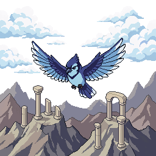

# Skywing Ruins

A tiny Flappy-Bird-style game written in Python with the [Arcade](https://api.arcade.academy/) library. A learning project — gameplay code lives in [main.py](main.py), with persistent score history split out into [score_store.py](score_store.py) so it can be unit-tested.



## Install

This project uses [`uv`](https://docs.astral.sh/uv/) for dependency management. From the project root:

```bash
uv sync
```

## Run

```bash
uv run python main.py
```

## Controls

| Key | Action |
| --- | --- |
| `Space` | Flap (also: start game from title) |
| `Enter` | Play again (game-over only) |
| `Left` / `A` | Drift left |
| `Right` / `D` | Drift right |
| `P` | Pause / unpause |
| `R` | Return to title (game-over only) |
| `N` | Open profile picker — switch profiles or add a new one (title screen) |
| `H` | View high-score board (title screen) |
| `Q` | Quit |

## How to play

Tap `Space` to flap upward against gravity. Drift through the gaps between stone columns — touching a column or flying off the top or bottom of the screen ends the game. You score one point each time you fully clear a column.

The game ramps in difficulty as your score climbs: column gaps shrink and columns spawn closer together, peaking around 30 points.

Press `P` any time during play to freeze the screen (handy for screenshots) and `Space` or `P` to resume.

## Weather

The game cycles between clear weather and thunderstorms. Each storm starts with a full-screen lightning flash, a delayed thunder clap, and then rain falling in from above and the right. During the storm, periodic lightning + thunder events fire on a random interval, and the rain keeps streaming until the storm passes (typically 30–60 seconds). All visuals are pure code (no assets needed).

The rain and thunder *sounds* are optional — drop `rain.{wav,ogg,mp3}` and/or `thunder.{wav,ogg,mp3}` into [assets/](assets/) and they'll be picked up automatically. The rain plays in a low-volume loop while a storm is active; thunder claps fire individually shortly after each lightning flash.

## Profiles and high scores

Every finished run is appended to `scores.json` in the project root, tagged with the current profile name. The title screen shows the all-time high score and the active profile; press `N` to open the profile picker (cycle through existing profiles with ↑/↓, `Enter` to select, or pick the `+ Add new profile…` row to type a new name), and `H` to view the top-10 leaderboard across all profiles. After each death, the game-over screen shows your personal best (with a `★ NEW!` flag when you set a new one).

The `scores.json` file is git-ignored so each player keeps their own history.

## Tests

`ScoreStore` is the only piece of game logic that doesn't require an OpenGL context, so it has unit tests:

```bash
uv sync --group dev
uv run pytest
```
